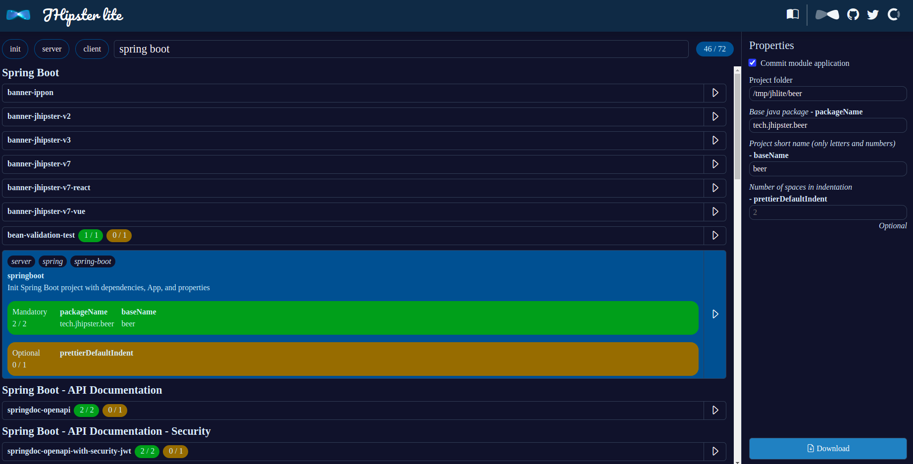
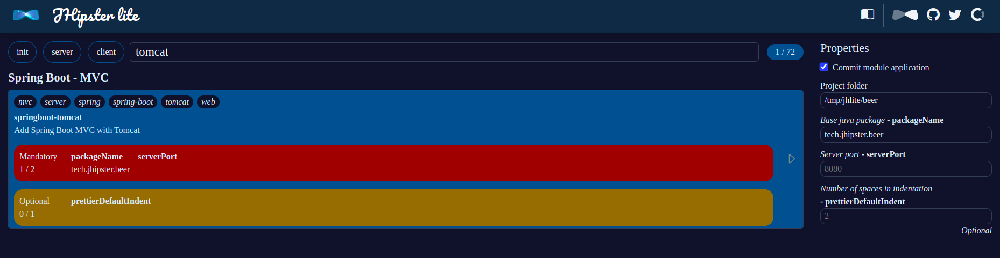
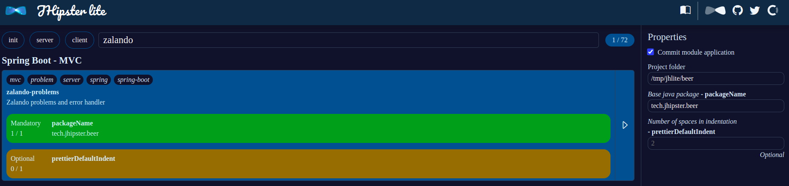

# JHipster Lite quick start guide

You can follow this guide to generate your new project with JHipster Lite.

You can use the online version at [https://lite.jhipster.tech](https://lite.jhipster.tech)

Or, you can start JHipster Lite locally. Clone the project and in the `jhipster-lite` folder, just launch: `./mvnw`

## Sample project: Java, Spring Boot and Vue 3

### Project folder

First, you need to fill the `Project folder`:

### Init

Select the `init` module, fill the different fields, then, you'll be able to apply the module: you project will be initialized, with Git configuration, the IDE configuration, a simple `package.json`, etc.

### Maven

Search the `maven` module, select it, then, you need to fill the `packageName` before applying this module. It will generate a Maven project, by adding a Maven wrapper and a default `pom.xml`:

### Java base

Search the `java base` module and select it. It will add the Java base and all important asserts classes, used in project with Hexagonal Architecture:

### Spring Boot

Search the `spring boot` module, select the simple `spring boot` module, and apply it. It will add a Main Class, the spring boot dependencies, the spring boot properties.  

### Spring Boot MVC with Tomcat

Search the `tomcat` module, select it, fill the `serverPort` property and apply it. It will add `Spring Boot MVC dependencies with Tomcat`, so your project will be an application server, using Tomcat:

Search the `zalando` module, select it and apply it.

### Vue

Search the `vue` module, select it and apply it. It will add a simple front-end, using Vue 3:

### Frontend Maven Plugin

To make the front-end work with the back-end, you need to add the `Frontend Maven Plugin module:

### Download

Finally, you can download the project:

### Start the project

Unzip the project, go into the folder, and start your project: `./mvnw`. Maybe you'll need to `chmod +x mvnw`.

You should be able to access to your project at [http://localhost:8080](http://localhost:8080)

## Simple Java library

You can use the following modules, applying by respecting this order:

- init
- maven
- java-base

Then, you can start to code :-)

## Complete project with dummy context

You can use all the following modules:

- init
- maven
- java-base
- jacoco-check-min-coverage
- springboot
- springboot-tomcat
- zalando-problems
- bean-validation-test
- java-archunit
- springboot-jwt
- springboot-jwt-basic-auth
- springdoc-openapi-with-security-jwt
- springboot-cucumber
- cucumber-jwt-authentication
- dummy-feature
- vue
- frontend-maven-plugin

You'll be able to access to [swagger ui](http://localhost:8080/swagger-ui/index.html)
