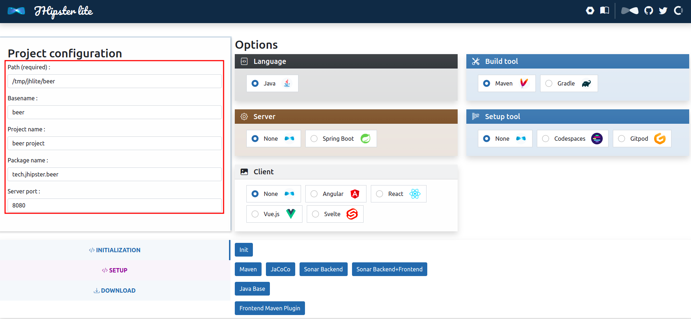
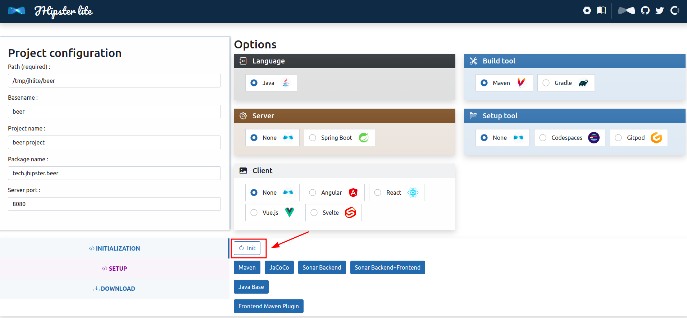
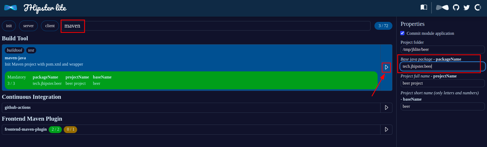
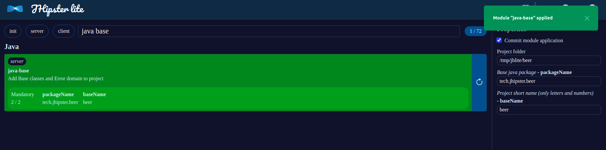
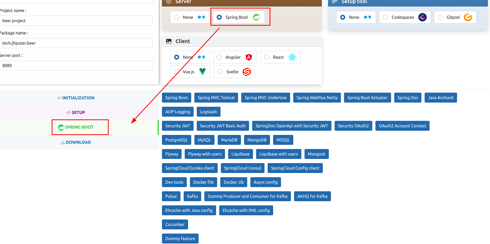
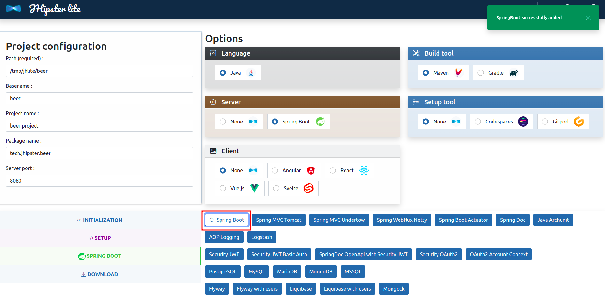
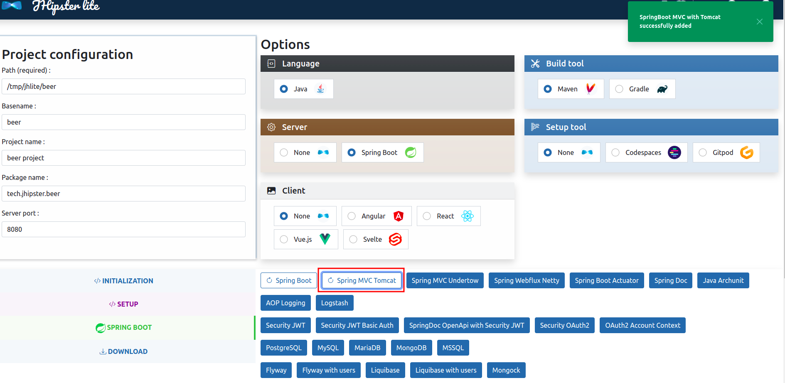
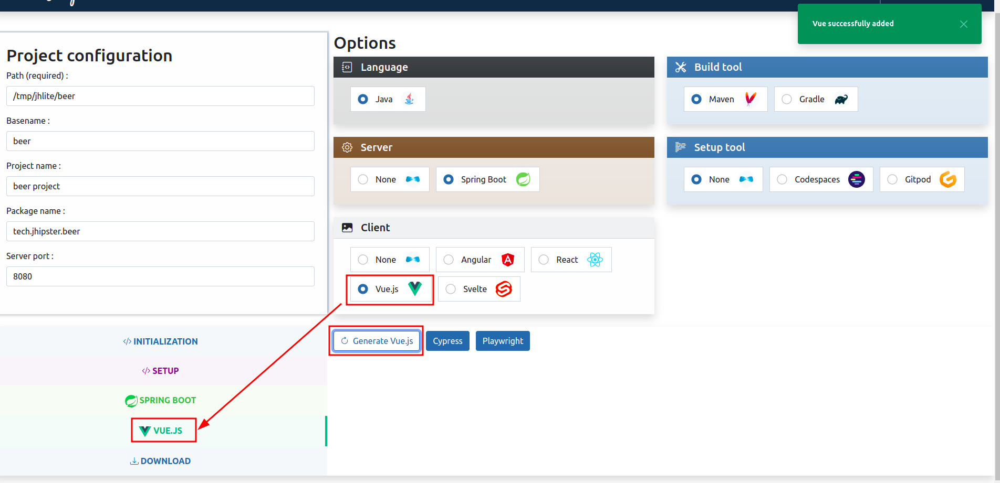
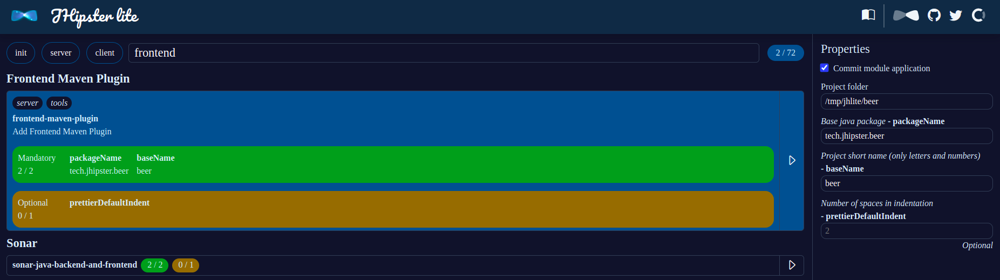
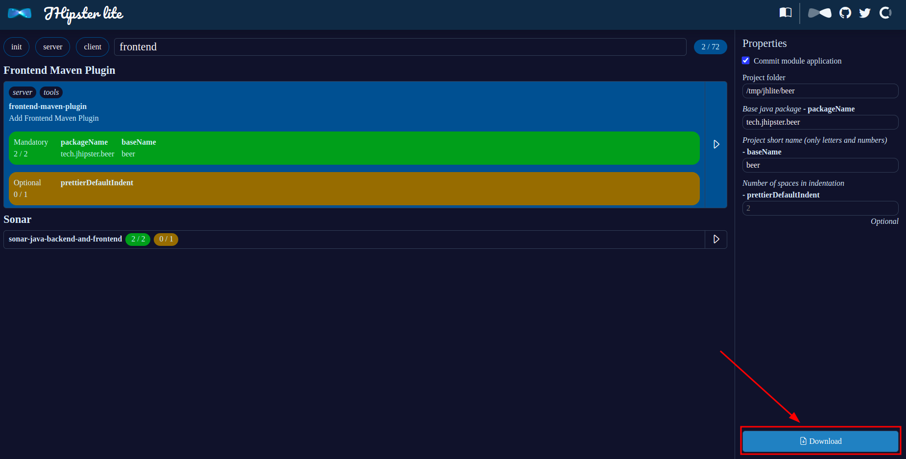

# Guides

You can follow this guide to generate your new project with JHipster Lite.

First, you need to start JHipster Lite. In the `jhipster-lite` folder, just launch: `./mvnw`

Check if you can access to [http://localhost:7471](http://localhost:7471)

Then, you need to fill the different fields, before generating something:

You can init your project, adding git configuration, editor config and a simple `package.json` file:

Let's try to generate a Maven project, by adding a Maven wrapper and a default `pom.xml`:

Let's add the Java base and all asserts classes:

We need to select the Spring Boot section:

Now, maybe we want to add Spring Boot:

Let's add an application server, using Tomcat:

We should add a simple front, using Vue 3:

To make the frontend working ith the backend, we need to add Frontend Maven Plugin:

Finally, we can download the project:

